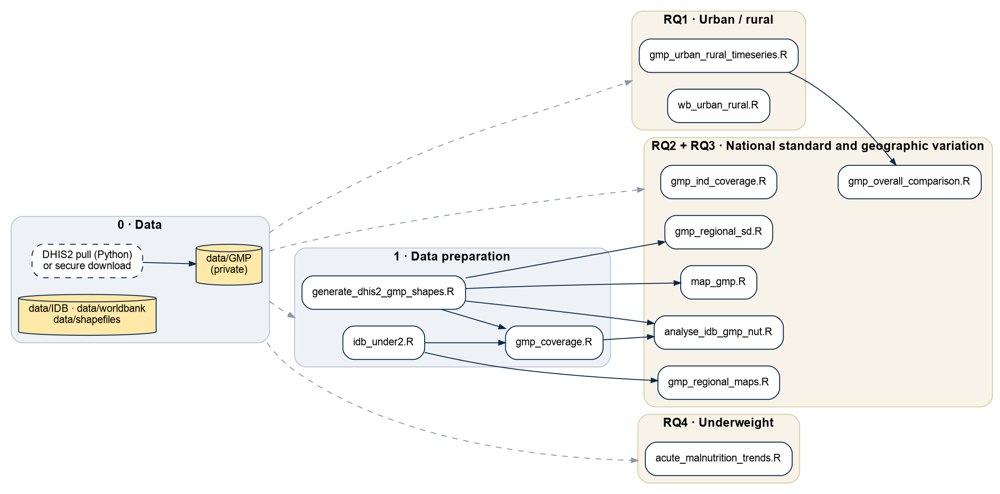

# Growth monitoring and promotion (GMP) analysis: Ethiopia

## Policy questions

1. 🏙️ What is GMP coverage split by urban and rural areas?
2. 🎯 How many regions, zones, and woredas reach the national standard for GMP coverage?
3. 🗺️ What is the geographic variation in GMP service coverage among children under 2?
4. ⚖️ Among children who receive GMP services, what proportion are underweight?

## Overview

Growth Monitoring and Promotion (GMP) is a routine child health service. *Monitoring* is the regular measurement and plotting of a child's growth, so that faltering is detected before the child is visibly malnourished. *Promotion* is the counselling, referral, and follow-up that responds to those measurements. GMP targets children up to five, with a focus on the first two years of life. Ethiopia's national standard for GMP coverage is 75%.

This repository contains the code for the EDAM GMP use case, which assessed GMP coverage across Ethiopia with a focus on geographic variation. The policy questions were co-developed with the Ministry of Health. The analysis is descriptive. It combines monthly routine GMP data from the Ministry of Health DHIS2 instance (2018–2025, admin levels 1–6) with population estimates from the US Census Bureau International Database (IDB) and the World Bank, and with administrative boundaries from DHIS2, OCHA, and ESPEN.

### Documents

| Document | Contents |
|---|---|
| *EDAM Policy Brief: GMP Coverage* (September 2026) | Key messages, findings, and recommendations for the Federal Ministry of Health |
| *GMP Technical Summary* (July 2026) | Full data, methods, limitations, and outstanding questions |
| *Use case results* slides (June 2026) | Results for the use case; all figures and statistics presented were generated by the scripts below (see [Outputs](#outputs)) |

## Methods summary

### Data

| DHIS2 variable | Type | Role |
|---|---|---|
| `NUT_Children <2 Years Weighted during GMP Session` | Data element | Numerator, Q1–Q3 |
| `_2017_Number of children <5 year screened and have moderate acute malnutrition` | Data element | Proxy outcome, Q4 |
| `_2017_Number of children <5 year screened and have severe acute malnutrition` | Data element | Proxy outcome, Q4 |
| `WBP-Total population` | Indicator | Denominator (total population) |
| `NUT_% of Children < 2 years participated in GMP` | Indicator | Comparator coverage estimate |

DHIS2 periods are assumed to be in the Ethiopian calendar and are converted to Gregorian dates. Values split by age or sex are summed to one value per admin unit and month.

### GMP coverage and denominator scenarios

GMP coverage is the number of children under 2 weighed during a GMP session divided by the estimated number of children under 2. DHIS2 does not record the under-2 population, so coverage is calculated under four denominator scenarios:

| Scenario | Denominator | Source |
|---|---|---|
| 1 | As implemented in the existing DHIS2 indicator | DHIS2 |
| 2 | WBP-Total population × IDB proportion aged ≤2 | DHIS2, IDB |
| 3 | WBP-Total population split by urban/rural × IDB proportion aged ≤2 | DHIS2, IDB |
| 4 | IDB total population × IDB proportion aged ≤2 | IDB |

Scenario 1 is substantially higher than the others, while scenarios 2 and 4 are close. Scenarios 2 and 3 use the same DHIS2 variable, so they should agree. However, the urban and rural values of `WBP-Total population` add up to less than the aggregated total that DHIS2 reports.  A smaller denominator makes coverage look higher, so scenario 3 likely overstates coverage relative to scenario 2. Results are therefore reported under scenarios 1 and 2. Urban/rural coverage splits the scenario 2 denominator using World Bank urban/rural population shares.

### Spatial harmonisation

DHIS2 rows carry an org unit name but no coordinates or geographic code, so units are joined to OCHA boundaries by name. DHIS2 has its own org unit shapefiles, but they have many gaps, features at 0,0 or outside Ethiopia, and duplicated names. These can be seen in the quality checks in `data_quality/shapefiles/explore_dhis2_geojsons.R`. The OCHA shapefiles were therefore used. The DHIS2 and ESPEN shapefiles are used only to help locate units within OCHA areas. This is done in `generate_dhis2_gmp_shapes.R`:

1. **Prepare names and shapes.** DHIS2 features are combined, deduplicated, and repaired. Names are normalised, known variants corrected (for example Gambella → Gambela), and manual fixes applied from `manual_name_updates.csv`.
2. **Match names, within each admin level,** against DHIS2, then OCHA, then ESPEN, passing only unmatched units on. Within each source the rules run from strictest to loosest: exact raw name, exact normalised name, exact after suffix standardisation (for example PHCU ↔ health center), then Jaro-Winkler fuzzy match accepted automatically only if the distance is < 0.02. Matches ≥ 0.02 are reviewed by hand and added to `manual_name_updates.csv` if a match is found.
3. **Assign to OCHA areas.** DHIS2 and ESPEN matches are reduced to centroids and assigned to the containing OCHA area, or the nearest one for points outside every polygon. The source and rule behind each match, and any nearest-area fallback, are recorded. Units that could not be placed are written to `input_issues.csv`.

### Question 4

We could not find any outcome GMP sessions in DHIS2, so question 4 could not be answered as posed. Counts of children screened with moderate (MAM) and severe (SAM) acute malnutrition are used as proxies, for the 0–5 month age band only. No suitable denominator was found, so counts are not scaled and cannot be compared between areas.

## Key findings

These findings may not be used or shared without permission. See [`src/R/outputs/DATA_NOTICE.md`](src/R/outputs/DATA_NOTICE.md).

- **National coverage** was 64% under the existing DHIS2 indicator (scenario 1) and 43% under the alternative estimate (scenario 2).
- **Urban and rural:** children weighed per month rose in both urban and rural areas between 2018 and 2025. Rural coverage is still higher (44% vs 39%), but urban coverage has grown faster.
- **National standard:** under the existing indicator only Oromia and Sidama meet 75%, with Amhara and Central Ethiopia close. Under the alternative scenarios no region does. 
- **Geographic variation:** Oromia and Amhara improved most. Gambela, Somali, and Afar should be prioritised given their low coverage and uneven service delivery.
- **Data quality:** data issues severely limited this analysis. Strengthening and extending it would require improvements to DHIS2: correcting its shapefiles, fixing how locations are stored, consolidating totals across administrative units and category disaggregations, and assessing the quality of the existing GMP indicator.

## Limitations

- **Estimated denominator.** The under-2 population is not directly observed, so coverage figures depend on which estimate is used.
- **Intercensal projections.** Population estimates become less reliable further from the last census, so the later years are the least certain.
- **≤2 vs <2.** The IDB proportion covers 0–24 months while the numerator covers 0–23 months, so coverage is slightly understated.
- **National conversion factor.** One under-2 proportion is applied to every unit, which assumes the same age structure everywhere.
- **Name-based joins.** A high share of data from zonal level down could not be matched to boundaries. Matching DHIS2 loctions to shape files was reliable only at regional level.
- **Fixed boundaries.** One set of boundaries is applied to all years, 2018–2025.
- **Monitoring only.** The numerator counts children weighed, which is the monitoring component of GMP. No data on the promotion component (counselling, referral, and follow-up) were found, so coverage reflects monitoring only.
- **Question 4 proxy.** MAM/SAM screening counts of children aged 0–5 months who were not necessarily seen at a GMP session. This question needs to be redone with the correct data.


## Workflow
All scripts run from the repository root. They use [`here`](https://here.r-lib.org/) to build paths, so you do not need to set a working directory.

- **Dashed grey arrows** show that the scripts in each group read the raw data in `data/`.
- **Solid arrows** are script dependencies: the script at the head of the arrow reads files written by the script at its tail. The scripts must therefore run in arrow order. For example, run `idb_under2.R`, then `gmp_coverage.R`, then `analyse_idb_gmp_nut.R`.

Scripts with no solid arrow pointing to them depend only on the raw data. They can run at any point once the data are in place.



The diagram is drawn from [`images/workflow.dot`](images/workflow.dot). After editing it, regenerate with `dot -Tpng -Gdpi=150 images/workflow.dot -o images/workflow.png` (Graphviz).

## Running the analysis

### Step 0: Get the data

> [!IMPORTANT]
> **The GMP data are private and are not included in this repository.**
> Either download them from the secure source provided to you, or pull them from DHIS2 yourself (below). Place the CSV files in:
> - `data/GMP/data_elements/` (`malnutrition_de_level*.csv`)
> - `data/GMP/indicators/` (`malnutrition_ind_level*.csv`)

All other inputs are public and included in `data/` (see [Data sources](#data-sources)).

<details>
<summary><b>Optional: pull the GMP data from DHIS2</b> (requires Ethiopian MoH DHIS2 credentials)</summary>

The commands below read your DHIS2 credentials from the `DHIS2_USERNAME` and `DHIS2_PASSWORD` environment variables. Set them first:

```sh
export DHIS2_USERNAME="your-username"
export DHIS2_PASSWORD="your-password"
```

```sh
cd src/python/DHIS2-pull

# Optional: list all available GMP / malnutrition variables (writes malnutrition_metadata.csv)
python fetch_metadata.py --username "$DHIS2_USERNAME" --password "$DHIS2_PASSWORD"

# Pull data elements and indicators for every org unit level
python fetch_malnutrition.py -u "$DHIS2_USERNAME" -p "$DHIS2_PASSWORD" -c inputs/malnutrition_data_elements.json
python fetch_malnutrition.py -u "$DHIS2_USERNAME" -p "$DHIS2_PASSWORD" -c inputs/malnutrition_indicators.json

# Move the outputs into the data folder
mv malnutrition_de_level*.csv  ../../../data/GMP/data_elements/
mv malnutrition_ind_level*.csv ../../../data/GMP/indicators/
```

The variables pulled are listed in `inputs/malnutrition_de_ids.txt` and `inputs/malnutrition_ind_ids.txt`. Note that `fetch_malnutrition.py` skips periods it has already queried. Use `--levels 3,4,5` to pull specific org unit levels only.

DHIS2 periods use the Ethiopian calendar. `fetch_malnutrition.py` adds a Gregorian date column. For CSVs pulled without it, run `python add_gregorian_dates.py`.

</details>

### Step 1: Data preparation

Run these first. `idb_under2.R` and `generate_dhis2_gmp_shapes.R` must both run before `gmp_coverage.R`.

| Script | What it does | Main outputs |
|---|---|---|
| `src/R/data_preparation/idb_under2.R` | Derives the proportion of the population aged under 2 per year from the IDB age pyramid and applies it to every area in `Ethiopia.xlsx` | `idb_under2_proportion.csv`, `idb_under2_population.csv` |
| `src/R/data_preparation/gmp_coverage.R` | Computes GMP coverage (children weighed ÷ estimated under-2) with a DHIS2 population × IDB proportion denominator and with an IDB denominator | `gmp_nut_coverage_idb.csv`, `idb_gmp_nut.csv` |
| `src/R/data_preparation/generate_dhis2_gmp_shapes.R` | Matches DHIS2 org units to OCHA and ESPEN boundaries by name (with manual fixes from `manual_name_updates.csv`) | `gmp_spatial.csv`, `input_issues.csv` |

### Step 2: Research questions

Within each question, run the scripts in the order listed.

#### RQ1: Urban / rural coverage (`src/R/RQ1_urban_rural/`)

| Script | What it does | Depends on |
|---|---|---|
| `gmp_urban_rural_timeseries.R` | Annual national counts of children weighed and urban/rural shares, plus the urban/rural denominators used for the coverage scenarios | Raw data only |
| `wb_urban_rural.R` | Plots World Bank urban vs rural share of the population | Raw data only |

#### RQ2 and RQ3: National standard and geographic variation (`src/R/RQ2_RQ3_national_level_and_geographic_variation/`)

| Script | What it does | Depends on |
|---|---|---|
| `gmp_overall_comparison.R` | Compares national GMP coverage, 2018–2025, under the four denominator scenarios | `gmp_urban_rural_timeseries.R` |
| `gmp_ind_coverage.R` | Distribution of the DHIS2 coverage indicator by admin level, and the share of units in each coverage band (including ≥75%) | Raw data only |
| `gmp_regional_maps.R` | Regional coverage maps for the DHIS2 indicator and scenario 2 | `idb_under2.R` |
| `map_gmp.R` | Maps of children weighed by region, zone, and woreda, by year and for 2025 | `generate_dhis2_gmp_shapes.R` |
| `gmp_regional_sd.R` | Month-to-month variability (SD and CV) of children weighed by region in 2025 | `generate_dhis2_gmp_shapes.R` |
| `analyse_idb_gmp_nut.R` | Regional coverage summaries, growth, and maps for both coverage datasets | `gmp_coverage.R`, `generate_dhis2_gmp_shapes.R` |

#### RQ4: Underweight (`src/R/RQ4_underweight/`)

| Script | What it does | Depends on |
|---|---|---|
| `acute_malnutrition_trends.R` | Monthly and annual national counts of babies (0–5 months) screened with moderate (MAM) and severe (SAM) acute malnutrition. MAM and SAM exist only at national level | Raw data only |

### Optional: Data quality checks (`src/R/data_quality/`)

These are the data quality checks done at the start of the analysis. They are not needed to reproduce the results, with one exception: `explore_dhis2_geojsons.R` also merges the six DHIS2 level files into `data/shapefiles/DHIS2/dhis2_combined.geojson`, which `generate_dhis2_gmp_shapes.R` reads. However, the merged file is already in the repository, so you only need to run this script if you want its other outputs: plots of each DHIS2 level and a table of locations with their distance from the Ethiopia boundary.

| Script | What it checks |
|---|---|
| `DHIS2/gmp_completeness.R` | Share of org units reporting each GMP variable per year, by admin level |
| `DHIS2/completeness_report.R` | Date ranges and completeness of each indicator, by admin level and year |
| `shapefiles/dhis2_shapefile_quality.R` | DHIS2 geometries outside Ethiopia and duplicated names |
| `shapefiles/explore_dhis2_geojsons.R`, `explore_ocha.R`, `explore_espen.R` | Plots of each boundary set for visual inspection (`explore_dhis2_geojsons.R` also builds `dhis2_combined.geojson`) |

## Outputs

Outputs are written to `src/R/outputs/`, which mirrors the `src/R/` folder structure. Re-running the scripts overwrites them. Each script writes to:

- `used/<script>/`: figures shown in the use case results slides from June, each saved with a CSV of the plotted data
- `not_used/<script>/`: all other figures and tables, including intermediate files that other scripts read. These are not tracked by git; run the scripts to create them.

`src/R/outputs/README.md` lists every slide figure with its slide number, the script that creates it, and its CSV columns.

The outputs may not be used or shared without permission. See [`src/R/outputs/DATA_NOTICE.md`](src/R/outputs/DATA_NOTICE.md).

## Repository structure

```
├── data/
│   ├── GMP/                     # private: add the DHIS2 CSVs here (see Step 0)
│   ├── IDB/                     # US Census Bureau IDB population estimates
│   ├── worldbank/               # World Bank urban population share
│   └── shapefiles/              # OCHA, ESPEN, and DHIS2 boundaries
│
├── src/
│   ├── python/DHIS2-pull/
│   │   ├── fetch_metadata.py        # Lists available GMP / malnutrition variables
│   │   ├── fetch_malnutrition.py    # Pulls GMP data by org unit level
│   │   ├── add_gregorian_dates.py   # Adds Gregorian dates to existing CSVs
│   │   └── inputs/                  # Pull configs and lists of DHIS2 IDs
│   │
│   └── R/
│       ├── plotting_helpers.R       # Shared ggplot theme, palettes, and save helpers
│       ├── data_preparation/        # Step 1
│       ├── RQ1_urban_rural/         # Question 1
│       ├── RQ2_RQ3_national_level_and_geographic_variation/   # Questions 2 and 3
│       ├── RQ4_underweight/         # Question 4
│       ├── data_quality/            # Data quality checks
│       └── outputs/                 # Generated outputs
│
├── images/
│   ├── workflow.dot             # Workflow diagram source (Graphviz)
│   └── workflow.png
│
├── .here
└── README.md
```

## Data sources

| Folder | Source | Access |
|---|---|---|
| `data/GMP/` | Ethiopian Ministry of Health DHIS2 (`dhis.moh.gov.et`) | Private |
| `data/IDB/` | [US Census Bureau International Database](https://www.census.gov/data/developers/data-sets/international-database.html) | Public, included |
| `data/worldbank/` | [World Bank urban population share](https://data.worldbank.org/indicator/SP.URB.TOTL.IN.ZS) (indicator: `SP.URB.TOTL.IN.ZS`) | Public, included |
| `data/shapefiles/OCHA/` | [OCHA Common Operational Datasets](https://data.humdata.org/dataset/cod-ab-eth), version 04 (December 2025) | Public, included |
| `data/shapefiles/ESPEN/` | [WHO ESPEN cartography database](https://espen.afro.who.int/maps-data/data-query-tools/cartography-database) (2024): extra pool of place names | Public, included |
| `data/shapefiles/DHIS2/` | DHIS2 organisation unit geometries, as at May 2026 | Included |

## Requirements

R packages:

```r
install.packages(c(
  "dplyr", "ggplot2", "ggrepel", "ggtext", "gridExtra", "here", "patchwork",
  "readr", "readxl", "scales", "sf", "stringdist", "stringr", "tidyr"
))
```

Python (DHIS2 pull only): `requests`, `urllib3`, `pandas`.

## Authors

Tristan Naidoo, Research Associate, Imperial College London
Tarekegn Negese, Ministry of Health lead (next steps)

[EDAM: Ethiopian Data Analytics & Modelling Consortium](https://www.edamconsortium.org) · info@edamconsortium.org
