

# Figures from use case results

This document collects every figure shown in the use case results slides presnted on 8 June 2026 on growth monitoring and promotion (GMP) for children under 2 in Ethiopia. For each figure it gives the slide it appears on, the data behind it (as a CSV), and the R script that produces it.

## Data and definitions

See the [main README](../../../README.md) for the data, the four denominator scenarios, and the definitions used below ([Methods summary](../../../README.md#methods-summary), [Data sources](../../../README.md#data-sources)).

## Contents

| Slide | Figure | Section |
|---|---|---|
| 3 | [idb_under2_proportion_notitle](#slide-3-idb_under2_proportion_notitle) | Data sources |
| 4 | [wb_urban_rural_pct_notitle](#slide-4-wb_urban_rural_pct_notitle) | Data sources |
| 7 | [denominator_comparison](#slide-7-denominator_comparison) | Questions 1–3 |
| 8 | [scenario_comparison](#slide-8-scenario_comparison) | Questions 1–3 |
| 9 | [panel_abs_no_gmp](#slide-9-panel_abs_no_gmp) | Question 1 |
| 10 | [panel_pct_share_with_pop](#slide-10-panel_pct_share_with_pop) | Question 1 |
| 11 | [panel_wbp_total_no_gmp](#slide-11-panel_wbp_total_no_gmp) | Question 1 |
| 12 | [04_boxplot_no_outliers](#slide-12-04_boxplot_no_outliers) | Question 2 |
| 13 | [05_stacked_bands_by_level_latest_year](#slide-13-05_stacked_bands_by_level_latest_year) | Question 2 |
| 14 | [gmp_map_woreda_by_year](#slide-14-gmp_map_woreda_by_year) | Question 3 |
| 15 | [gmp_map_zonal_woreda_agg_by_year](#slide-15-gmp_map_zonal_woreda_agg_by_year) | Question 3 |
| 16 | [gmp_map_regional_by_year](#slide-16-gmp_map_regional_by_year) | Question 3 |
| 17 (top) | [gmp_map_regional_2025](#slide-17-top-gmp_map_regional_2025) | Question 3 |
| 17 (bottom left) | [gmp_map_zonal_woreda_agg_2025](#slide-17-bottom-left-gmp_map_zonal_woreda_agg_2025) | Question 3 |
| 17 (bottom right) | [gmp_map_woreda_2025](#slide-17-bottom-right-gmp_map_woreda_2025) | Question 3 |
| 18 | [gmp_regional_cv_2025](#slide-18-gmp_regional_cv_2025) | Question 3 |
| 19 (left) | [scenario1_map_2025](#slide-19-left-scenario1_map_2025) | Question 3 |
| 19 (right) | [scenario2_map_2025](#slide-19-right-scenario2_map_2025) | Question 3 |
| 20 | [scenario2_map_by_year](#slide-20-scenario2_map_by_year) | Question 3 |
| 23 | [trend_comparison_annual](#slide-23-trend_comparison_annual) | Question 4 |
| 24 | [trend_comparison](#slide-24-trend_comparison) | Question 4 |

## Data sources

### Slide 3: idb_under2_proportion_notitle

IDB total population (left axis) and the percentage aged ≤2 years (right axis, dashed), 2005–2025.

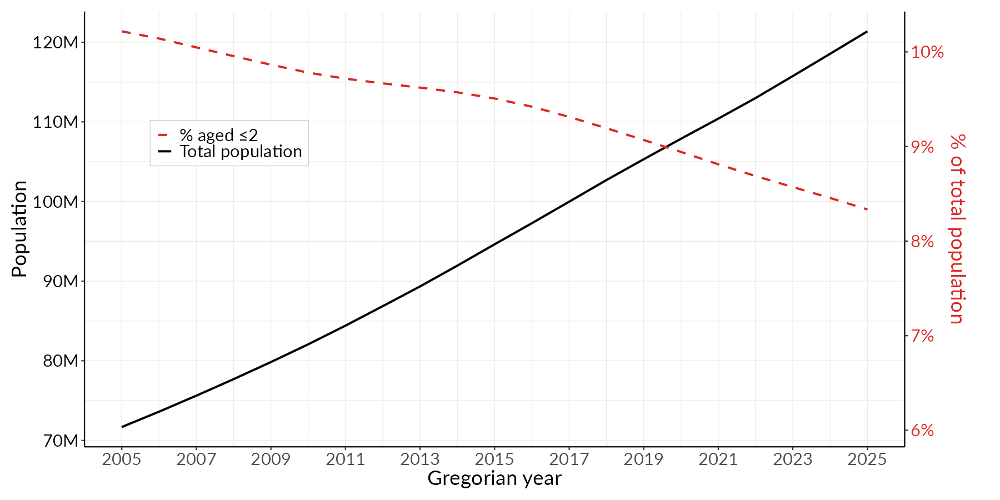

- **Slide title:** Data sources: US Census Bureau
- **Data:** [`data_preparation/used/idb_under2/idb_under2_proportion_notitle.csv`](data_preparation/used/idb_under2/idb_under2_proportion_notitle.csv)
- **Script:** [`src/R/data_preparation/idb_under2.R`](../../../src/R/data_preparation/idb_under2.R)

| Column | Description |
|---|---|
| `year` | Gregorian year |
| `total_pop` | IDB total population of Ethiopia |
| `proportion` | Percentage of the population aged ≤2 years |

> **Note:** The slide's callout boxes ("124m", "8.2%", labelled 2025) match the IDB **2026** values (124,224,192; 8.21%). The 2025 values are 121,372,632 and 8.33%.

### Slide 4: wb_urban_rural_pct_notitle

World Bank urban vs rural share of the total population, 2005–2025.

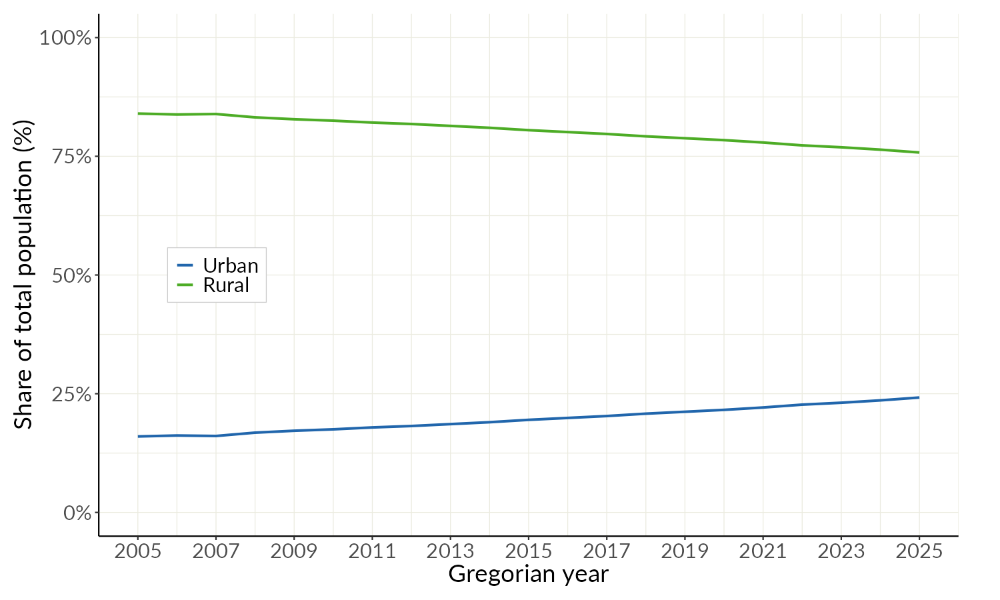

- **Slide title:** Data sources: World Bank
- **Data:** [`RQ1_urban_rural/used/wb_urban_rural/wb_urban_rural_pct_notitle.csv`](RQ1_urban_rural/used/wb_urban_rural/wb_urban_rural_pct_notitle.csv)
- **Script:** [`src/R/RQ1_urban_rural/wb_urban_rural.R`](../../../src/R/RQ1_urban_rural/wb_urban_rural.R)

| Column | Description |
|---|---|
| `year` | Gregorian year |
| `urban_rural` | Urban or Rural |
| `pct` | Share of the total population (%) |

## Questions 1–3: Estimating the number of children <2 and GMP coverage

### Slide 7: denominator_comparison

Estimated number of children <2 under each denominator scenario.

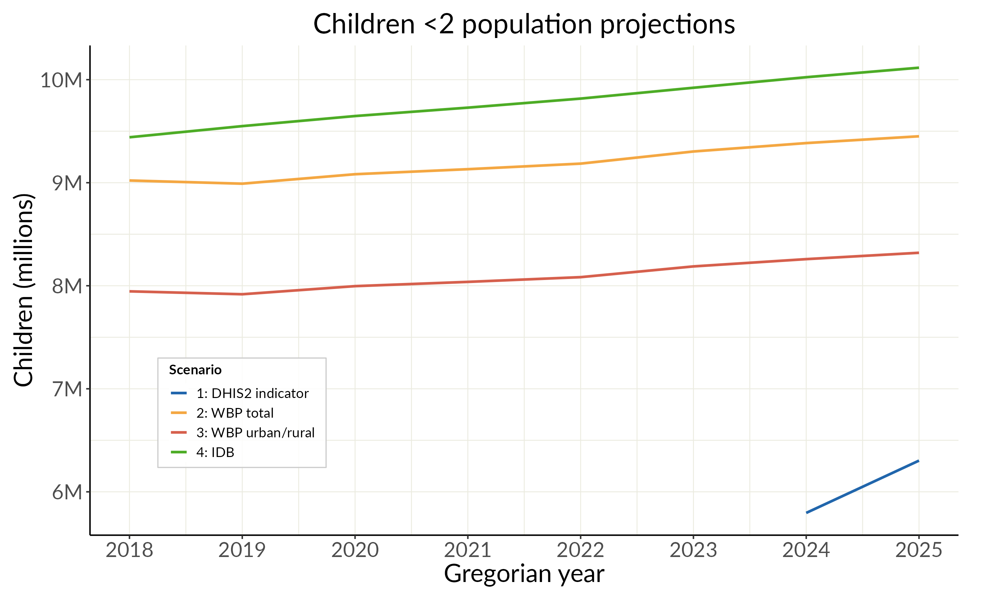

- **Slide title:** Estimates of the number of children <2 years
- **Data:** [`RQ2_RQ3_national_level_and_geographic_variation/used/gmp_scenario_comparison/denominator_comparison.csv`](RQ2_RQ3_national_level_and_geographic_variation/used/gmp_scenario_comparison/denominator_comparison.csv)
- **Script:** [`src/R/RQ2_RQ3_national_level_and_geographic_variation/gmp_overall_comparison.R`](../../../src/R/RQ2_RQ3_national_level_and_geographic_variation/gmp_overall_comparison.R)

| Column | Description |
|---|---|
| `greg_year` | Gregorian year |
| `scenario` | Denominator scenario (1: DHIS2 indicator, 2: WBP total, 3: WBP urban/rural, 4: IDB) |
| `under2_est` | Estimated children <2 (plotted in millions) |

### Slide 8: scenario_comparison

National GMP coverage for children <2 under the four denominator scenarios.

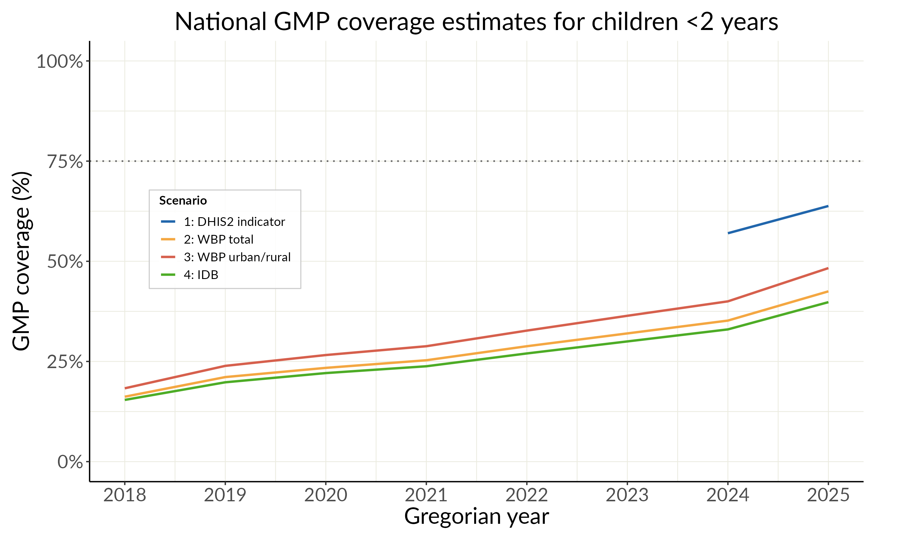

- **Slide title:** The variable of interest: proportion of children <2 years weighed
- **Data:** [`RQ2_RQ3_national_level_and_geographic_variation/used/gmp_scenario_comparison/scenario_comparison.csv`](RQ2_RQ3_national_level_and_geographic_variation/used/gmp_scenario_comparison/scenario_comparison.csv)
- **Script:** [`src/R/RQ2_RQ3_national_level_and_geographic_variation/gmp_overall_comparison.R`](../../../src/R/RQ2_RQ3_national_level_and_geographic_variation/gmp_overall_comparison.R)

| Column | Description |
|---|---|
| `greg_year` | Gregorian year |
| `scenario` | Denominator scenario (1–4) |
| `pct` | GMP coverage (%); dotted line marks the 75% national standard |

## Question 1: What is GMP coverage split by urban and rural areas?

### Slide 9: panel_abs_no_gmp

Average number of children <2 weighed per month during GMP sessions, by urban/rural (national level).

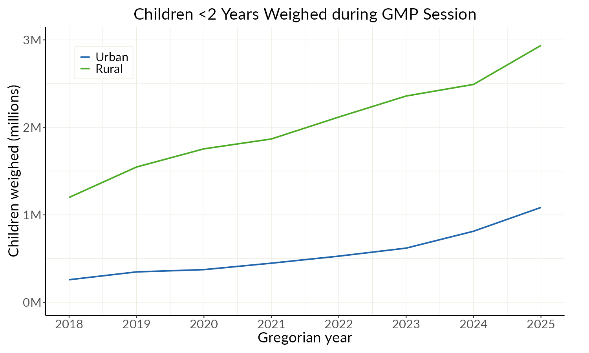

- **Slide title:** Question 1: What is GMP coverage split by urban and rural areas?
- **Data:** [`RQ1_urban_rural/used/gmp_urban_rural/panel_abs_no_gmp.csv`](RQ1_urban_rural/used/gmp_urban_rural/panel_abs_no_gmp.csv)
- **Script:** [`src/R/RQ1_urban_rural/gmp_urban_rural_timeseries.R`](../../../src/R/RQ1_urban_rural/gmp_urban_rural_timeseries.R)

| Column | Description |
|---|---|
| `greg_year` | Gregorian year |
| `urban_rural` | Urban or Rural |
| `monthly_mean` | Average children <2 weighed per month (plotted in millions) |

### Slide 10: panel_pct_share_with_pop

Urban/rural share of children weighed (solid) against the World Bank population share (dashed).

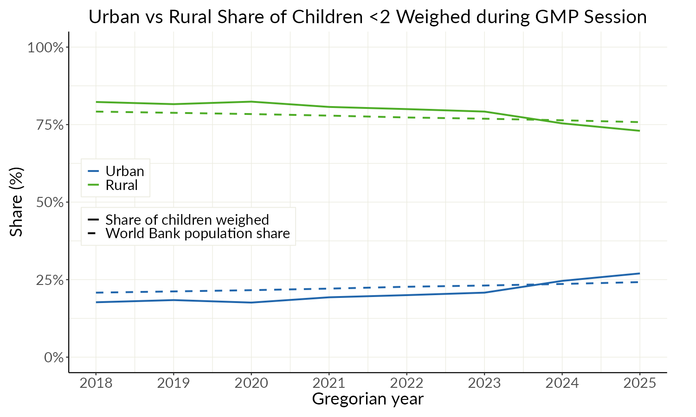

- **Slide title:** Question 1: What is GMP coverage split by urban and rural areas?
- **Data:** [`RQ1_urban_rural/used/gmp_urban_rural/panel_pct_share_with_pop.csv`](RQ1_urban_rural/used/gmp_urban_rural/panel_pct_share_with_pop.csv)
- **Script:** [`src/R/RQ1_urban_rural/gmp_urban_rural_timeseries.R`](../../../src/R/RQ1_urban_rural/gmp_urban_rural_timeseries.R)

| Column | Description |
|---|---|
| `greg_year` | Gregorian year |
| `urban_rural` | Urban or Rural |
| `series` | "Share of children weighed" (solid) or "World Bank population share" (dashed) |
| `value` | Share (%) |

### Slide 11: panel_wbp_total_no_gmp

National GMP coverage for children <2 by urban/rural. Denominator: scenario 2 × World Bank urban/rural proportion.

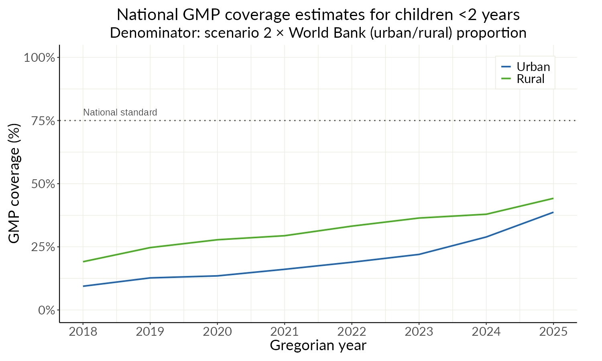

- **Slide title:** Question 1: What is GMP coverage split by urban and rural areas?
- **Data:** [`RQ1_urban_rural/used/gmp_urban_rural/panel_wbp_total_no_gmp.csv`](RQ1_urban_rural/used/gmp_urban_rural/panel_wbp_total_no_gmp.csv)
- **Script:** [`src/R/RQ1_urban_rural/gmp_urban_rural_timeseries.R`](../../../src/R/RQ1_urban_rural/gmp_urban_rural_timeseries.R)

| Column | Description |
|---|---|
| `greg_year` | Gregorian year |
| `urban_rural` | Urban or Rural |
| `coverage_pct` | GMP coverage (%); dotted line marks the 75% national standard |

## Question 2: How many regions, zones, and woredas reach national standards for GMP coverage?

### Slide 12: 04_boxplot_no_outliers

Distribution of the DHIS2 indicator *NUT_ % of Children < 2 years participated in GMP* by admin level, outliers hidden and the y-axis capped at 150%.

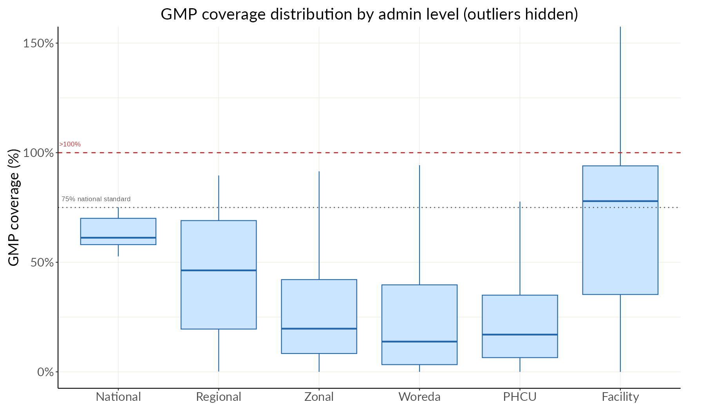

- **Slide title:** Question 2: How many regions, zones, and woredas reach national standards for GMP coverage?
- **Data:** [`RQ2_RQ3_national_level_and_geographic_variation/used/gmp_ind_coverage/04_boxplot_no_outliers.csv`](RQ2_RQ3_national_level_and_geographic_variation/used/gmp_ind_coverage/04_boxplot_no_outliers.csv)
- **Script:** [`src/R/RQ2_RQ3_national_level_and_geographic_variation/gmp_ind_coverage.R`](../../../src/R/RQ2_RQ3_national_level_and_geographic_variation/gmp_ind_coverage.R)

| Column | Description |
|---|---|
| `level_label` | Admin level |
| `value` | Indicator value (%) for one org unit in one reporting period (all years) |

> **Note:** One row per org unit and reporting period, which is why this CSV is large.

### Slide 13: 05_stacked_bands_by_level_latest_year

Percentage of 2025 reporting periods in each coverage band, by admin level.

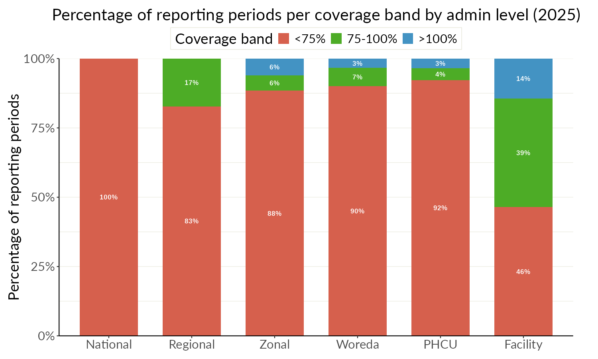

- **Slide title:** Question 2: How many regions, zones, and woredas reach national standards for GMP coverage?
- **Data:** [`RQ2_RQ3_national_level_and_geographic_variation/used/gmp_ind_coverage/05_stacked_bands_by_level_latest_year.csv`](RQ2_RQ3_national_level_and_geographic_variation/used/gmp_ind_coverage/05_stacked_bands_by_level_latest_year.csv)
- **Script:** [`src/R/RQ2_RQ3_national_level_and_geographic_variation/gmp_ind_coverage.R`](../../../src/R/RQ2_RQ3_national_level_and_geographic_variation/gmp_ind_coverage.R)

| Column | Description |
|---|---|
| `level_label` | Admin level |
| `band` | Coverage band: <75%, 75–100%, >100% |
| `n` | Number of reporting periods in the band |
| `prop` | Proportion of the level's reporting periods (bar height and label) |

## Question 3: What is the geographic variation in GMP coverage among children under 2?

### Slide 14: gmp_map_woreda_by_year

Children <2 weighed per month by woreda (OCHA adm3), 2018–2025.

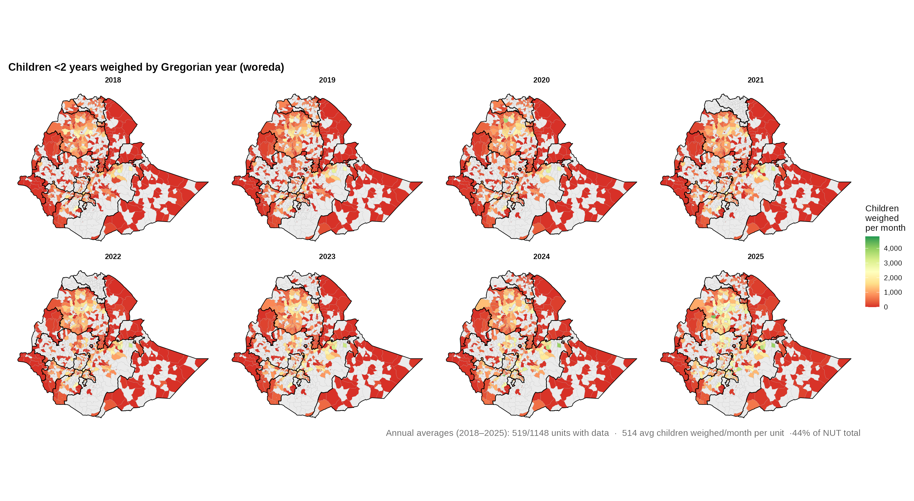

- **Slide title:** Question 3: What is the geographic variation in GMP coverage among children under 2?
- **Data:** [`RQ2_RQ3_national_level_and_geographic_variation/used/map_gmp/gmp_map_woreda_by_year.csv`](RQ2_RQ3_national_level_and_geographic_variation/used/map_gmp/gmp_map_woreda_by_year.csv)
- **Script:** [`src/R/RQ2_RQ3_national_level_and_geographic_variation/map_gmp.R`](../../../src/R/RQ2_RQ3_national_level_and_geographic_variation/map_gmp.R)

| Column | Description |
|---|---|
| `adm3_name` | OCHA woreda name |
| `adm3_pcode` | OCHA woreda pcode |
| `gregorian_year` | Gregorian year (facet) |
| `total_value` | Children weighed per month (mean of monthly values); blank = no matched DHIS2 data (grey) |

### Slide 15: gmp_map_zonal_woreda_agg_by_year

Children <2 weighed per month by zone (OCHA adm2), from woreda data aggregated to zones, 2018–2025.

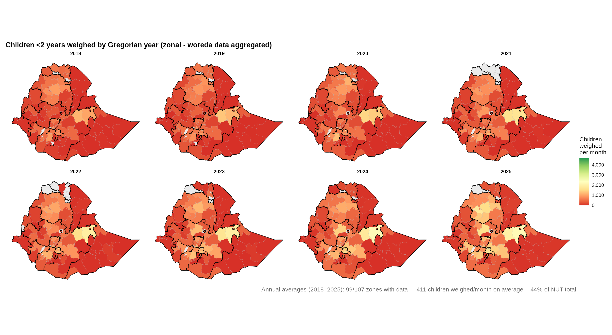

- **Slide title:** Question 3: What is the geographic variation in GMP coverage among children under 2?
- **Data:** [`RQ2_RQ3_national_level_and_geographic_variation/used/map_gmp/gmp_map_zonal_woreda_agg_by_year.csv`](RQ2_RQ3_national_level_and_geographic_variation/used/map_gmp/gmp_map_zonal_woreda_agg_by_year.csv)
- **Script:** [`src/R/RQ2_RQ3_national_level_and_geographic_variation/map_gmp.R`](../../../src/R/RQ2_RQ3_national_level_and_geographic_variation/map_gmp.R)

| Column | Description |
|---|---|
| `adm2_name` | OCHA zone name |
| `adm2_pcode` | OCHA zone pcode |
| `gregorian_year` | Gregorian year (facet) |
| `total_value` | Children weighed per month (mean of monthly values); blank = no data (grey) |

### Slide 16: gmp_map_regional_by_year

Children <2 weighed per month by region (OCHA adm1), 2018–2025.

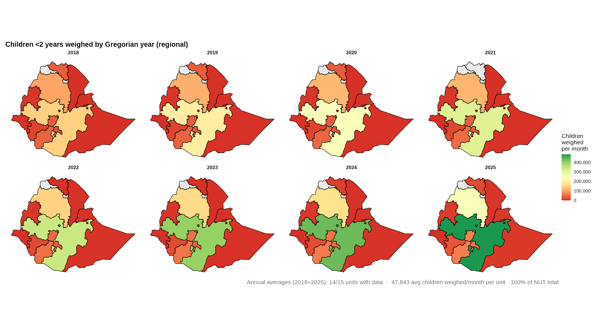

- **Slide title:** Question 3: What is the geographic variation in GMP coverage among children under 2?
- **Data:** [`RQ2_RQ3_national_level_and_geographic_variation/used/map_gmp/gmp_map_regional_by_year.csv`](RQ2_RQ3_national_level_and_geographic_variation/used/map_gmp/gmp_map_regional_by_year.csv)
- **Script:** [`src/R/RQ2_RQ3_national_level_and_geographic_variation/map_gmp.R`](../../../src/R/RQ2_RQ3_national_level_and_geographic_variation/map_gmp.R)

| Column | Description |
|---|---|
| `adm1_name` | OCHA region name |
| `adm1_pcode` | OCHA region pcode |
| `gregorian_year` | Gregorian year (facet) |
| `total_value` | Children weighed per month (mean of monthly values); blank = no data (grey) |

### Slide 17 (top): gmp_map_regional_2025

Children <2 weighed per month by region, 2025.

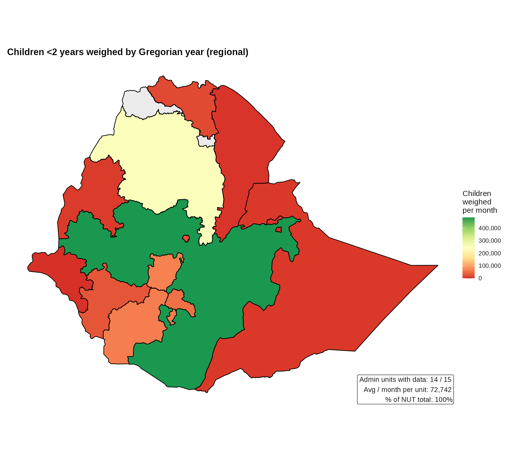

- **Slide title:** Question 3: What is the geographic variation in GMP coverage among children under 2?
- **Data:** [`RQ2_RQ3_national_level_and_geographic_variation/used/map_gmp/gmp_map_regional_2025.csv`](RQ2_RQ3_national_level_and_geographic_variation/used/map_gmp/gmp_map_regional_2025.csv)
- **Script:** [`src/R/RQ2_RQ3_national_level_and_geographic_variation/map_gmp.R`](../../../src/R/RQ2_RQ3_national_level_and_geographic_variation/map_gmp.R)

| Column | Description |
|---|---|
| `adm1_name` | OCHA region name |
| `adm1_pcode` | OCHA region pcode |
| `total_value` | Children weighed per month (mean of monthly values); blank = no data (grey) |

> **Note:** The slide shows a cropped version of this map.

### Slide 17 (bottom left): gmp_map_zonal_woreda_agg_2025

Children <2 weighed per month by zone (woreda data aggregated), 2025.

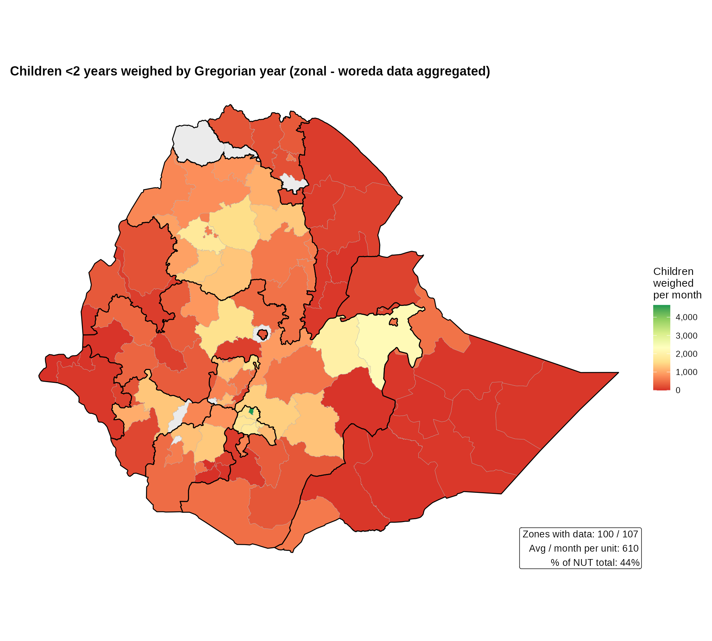

- **Slide title:** Question 3: What is the geographic variation in GMP coverage among children under 2?
- **Data:** [`RQ2_RQ3_national_level_and_geographic_variation/used/map_gmp/gmp_map_zonal_woreda_agg_2025.csv`](RQ2_RQ3_national_level_and_geographic_variation/used/map_gmp/gmp_map_zonal_woreda_agg_2025.csv)
- **Script:** [`src/R/RQ2_RQ3_national_level_and_geographic_variation/map_gmp.R`](../../../src/R/RQ2_RQ3_national_level_and_geographic_variation/map_gmp.R)

| Column | Description |
|---|---|
| `adm2_name` | OCHA zone name |
| `adm2_pcode` | OCHA zone pcode |
| `total_value` | Children weighed per month (mean of monthly values); blank = no data (grey) |

> **Note:** The slide shows a cropped version of this map.

### Slide 17 (bottom right): gmp_map_woreda_2025

Children <2 weighed per month by woreda, 2025.

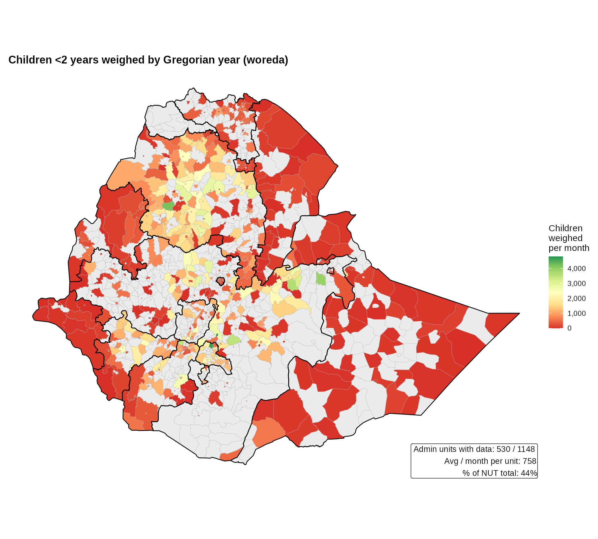

- **Slide title:** Question 3: What is the geographic variation in GMP coverage among children under 2?
- **Data:** [`RQ2_RQ3_national_level_and_geographic_variation/used/map_gmp/gmp_map_woreda_2025.csv`](RQ2_RQ3_national_level_and_geographic_variation/used/map_gmp/gmp_map_woreda_2025.csv)
- **Script:** [`src/R/RQ2_RQ3_national_level_and_geographic_variation/map_gmp.R`](../../../src/R/RQ2_RQ3_national_level_and_geographic_variation/map_gmp.R)

| Column | Description |
|---|---|
| `adm3_name` | OCHA woreda name |
| `adm3_pcode` | OCHA woreda pcode |
| `total_value` | Children weighed per month (mean of monthly values); blank = no data (grey) |

> **Note:** The slide shows a cropped version of this map.

### Slide 18: gmp_regional_cv_2025

Coefficient of variation of monthly children <2 weighed, by region, 2025.

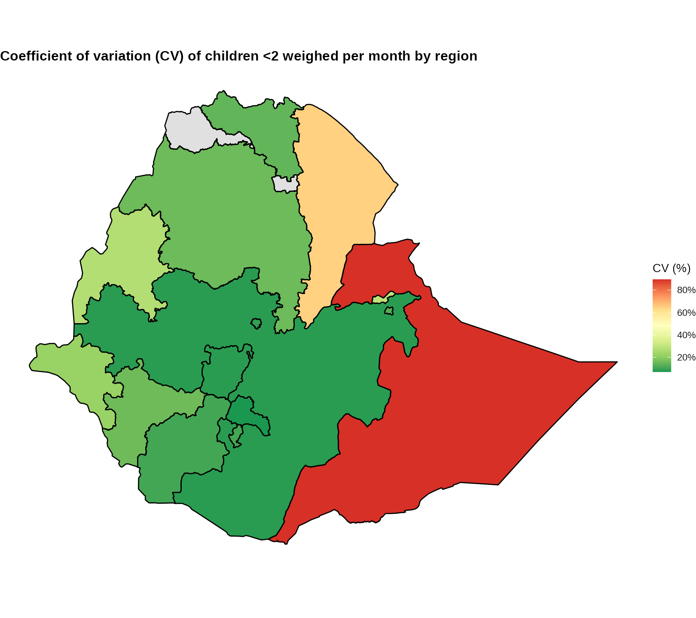

- **Slide title:** Question 3: What is the geographic variation in GMP coverage among children under 2?
- **Data:** [`RQ2_RQ3_national_level_and_geographic_variation/used/gmp_regional_sd/gmp_regional_cv_2025.csv`](RQ2_RQ3_national_level_and_geographic_variation/used/gmp_regional_sd/gmp_regional_cv_2025.csv)
- **Script:** [`src/R/RQ2_RQ3_national_level_and_geographic_variation/gmp_regional_sd.R`](../../../src/R/RQ2_RQ3_national_level_and_geographic_variation/gmp_regional_sd.R)

| Column | Description |
|---|---|
| `adm1_name` | OCHA region name |
| `adm1_pcode` | OCHA region pcode |
| `cv_pct` | CV (%) = SD / mean of the region's monthly totals; blank = no data (grey) |

### Slide 19 (left): scenario1_map_2025

Regional GMP coverage in 2025, scenario 1 (DHIS2 indicator).

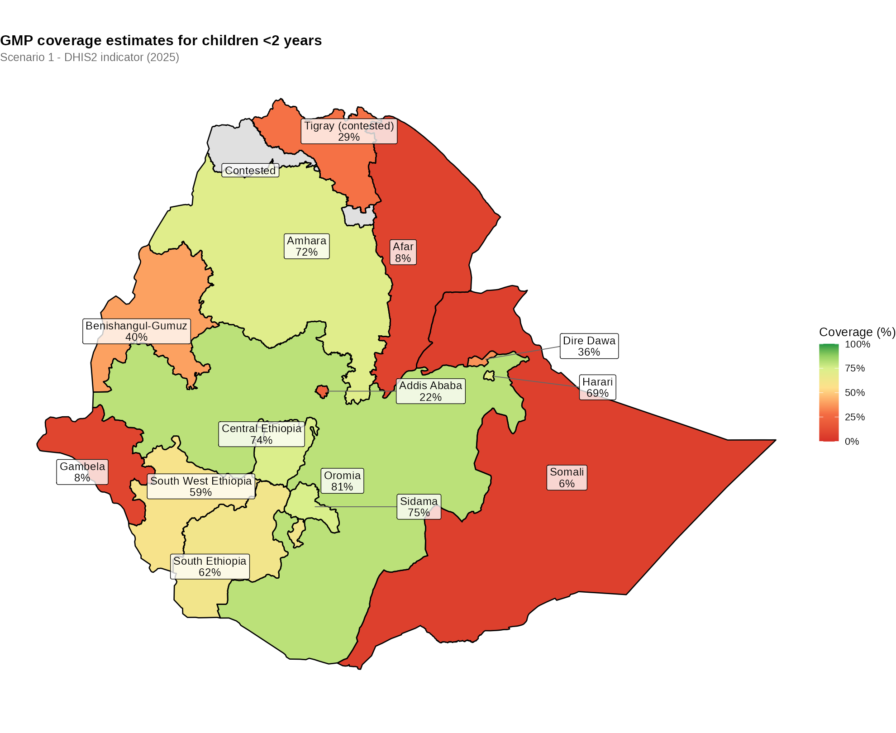

- **Slide title:** Question 3: What is the geographic variation in GMP coverage among children under 2?
- **Data:** [`RQ2_RQ3_national_level_and_geographic_variation/used/gmp_regional_maps/scenario1_map_2025.csv`](RQ2_RQ3_national_level_and_geographic_variation/used/gmp_regional_maps/scenario1_map_2025.csv)
- **Script:** [`src/R/RQ2_RQ3_national_level_and_geographic_variation/gmp_regional_maps.R`](../../../src/R/RQ2_RQ3_national_level_and_geographic_variation/gmp_regional_maps.R)

| Column | Description |
|---|---|
| `adm1_name` | OCHA region name |
| `adm1_pcode` | OCHA region pcode |
| `scenario1_pct` | GMP coverage (%), shown as the fill and the rounded label |

### Slide 19 (right): scenario2_map_2025

Regional GMP coverage in 2025, scenario 2 (WBP total × IDB proportion).

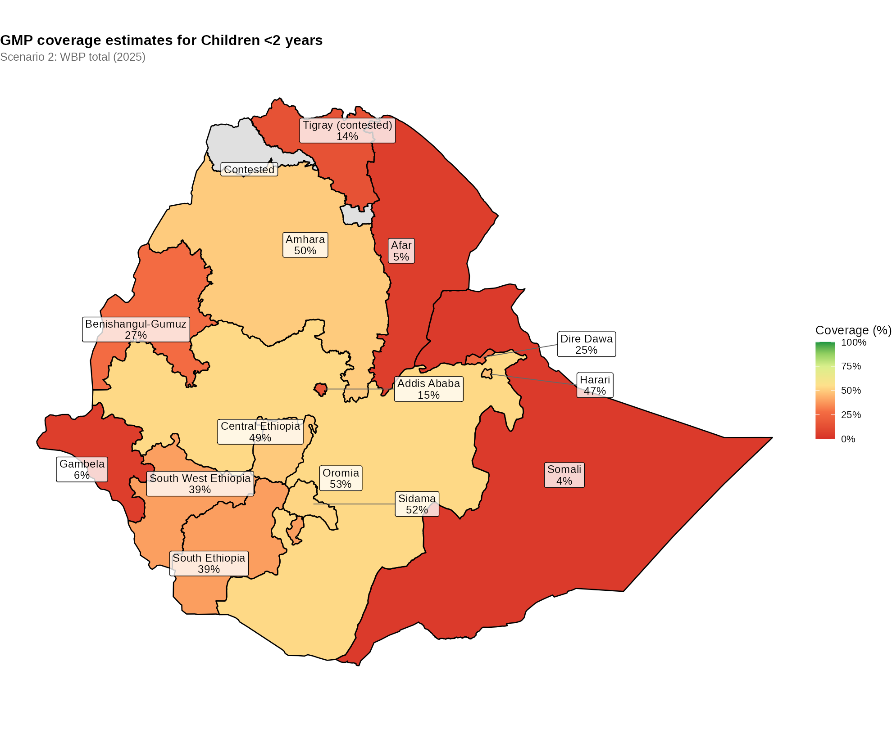

- **Slide title:** Question 3: What is the geographic variation in GMP coverage among children under 2?
- **Data:** [`RQ2_RQ3_national_level_and_geographic_variation/used/gmp_regional_maps/scenario2_map_2025.csv`](RQ2_RQ3_national_level_and_geographic_variation/used/gmp_regional_maps/scenario2_map_2025.csv)
- **Script:** [`src/R/RQ2_RQ3_national_level_and_geographic_variation/gmp_regional_maps.R`](../../../src/R/RQ2_RQ3_national_level_and_geographic_variation/gmp_regional_maps.R)

| Column | Description |
|---|---|
| `adm1_name` | OCHA region name |
| `adm1_pcode` | OCHA region pcode |
| `scenario2_pct` | GMP coverage (%), shown as the fill and the rounded label |

### Slide 20: scenario2_map_by_year

Regional GMP coverage over time, scenario 2.

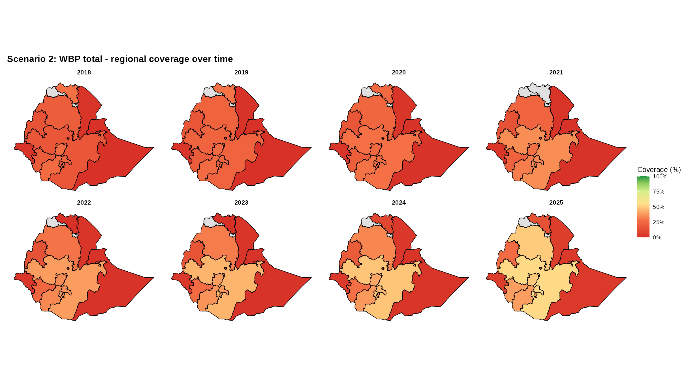

- **Slide title:** Question 3: What is the geographic variation in GMP coverage among children under 2?
- **Data:** [`RQ2_RQ3_national_level_and_geographic_variation/used/gmp_regional_maps/scenario2_map_by_year.csv`](RQ2_RQ3_national_level_and_geographic_variation/used/gmp_regional_maps/scenario2_map_by_year.csv)
- **Script:** [`src/R/RQ2_RQ3_national_level_and_geographic_variation/gmp_regional_maps.R`](../../../src/R/RQ2_RQ3_national_level_and_geographic_variation/gmp_regional_maps.R)

| Column | Description |
|---|---|
| `adm1_name` | OCHA region name |
| `adm1_pcode` | OCHA region pcode |
| `greg_year` | Gregorian year (facet) |
| `scenario2_pct` | GMP coverage (%); blank = no data (grey) |

## Question 4: Among children who receive GMP services, what proportion are underweight?

### Slide 23: trend_comparison_annual

Average number of babies (0–5 months) screened per month with acute malnutrition, national, 2018–2022.

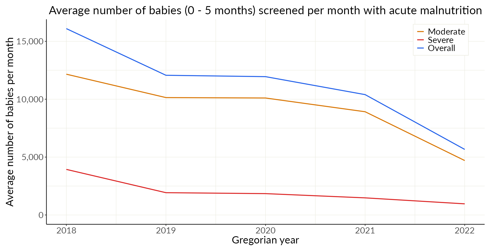

- **Slide title:** Question 4: Among children who receive GMP services, what proportion are underweight?
- **Data:** [`RQ4_underweight/used/acute_malnutrition_trends/trend_comparison_annual.csv`](RQ4_underweight/used/acute_malnutrition_trends/trend_comparison_annual.csv)
- **Script:** [`src/R/RQ4_underweight/acute_malnutrition_trends.R`](../../../src/R/RQ4_underweight/acute_malnutrition_trends.R)

| Column | Description |
|---|---|
| `greg_year` | Gregorian year |
| `metric` | Moderate (MAM), Severe (SAM), or Overall (MAM + SAM) |
| `count` | Average number of babies per month |

> **Note:** The script filters out 2023 (`greg_year != 2023`), so it is in neither the plot nor the CSV.

### Slide 24: trend_comparison

Monthly number of babies (0–5 months) screened with acute malnutrition, national.

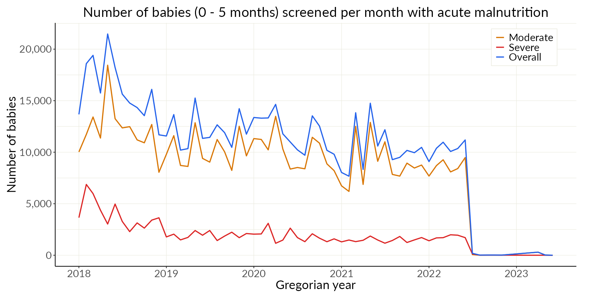

- **Slide title:** Question 4: Among children who receive GMP services, what proportion are underweight?
- **Data:** [`RQ4_underweight/used/acute_malnutrition_trends/trend_comparison.csv`](RQ4_underweight/used/acute_malnutrition_trends/trend_comparison.csv)
- **Script:** [`src/R/RQ4_underweight/acute_malnutrition_trends.R`](../../../src/R/RQ4_und*Use case update 8 June*erweight/acute_malnutrition_trends.R)

| Column | Description |
|---|---|
| `greg_date` | Gregorian start date of the reporting month |
| `metric` | Moderate (MAM), Severe (SAM), or Overall (MAM + SAM) |
| `count` | Number of babies |

